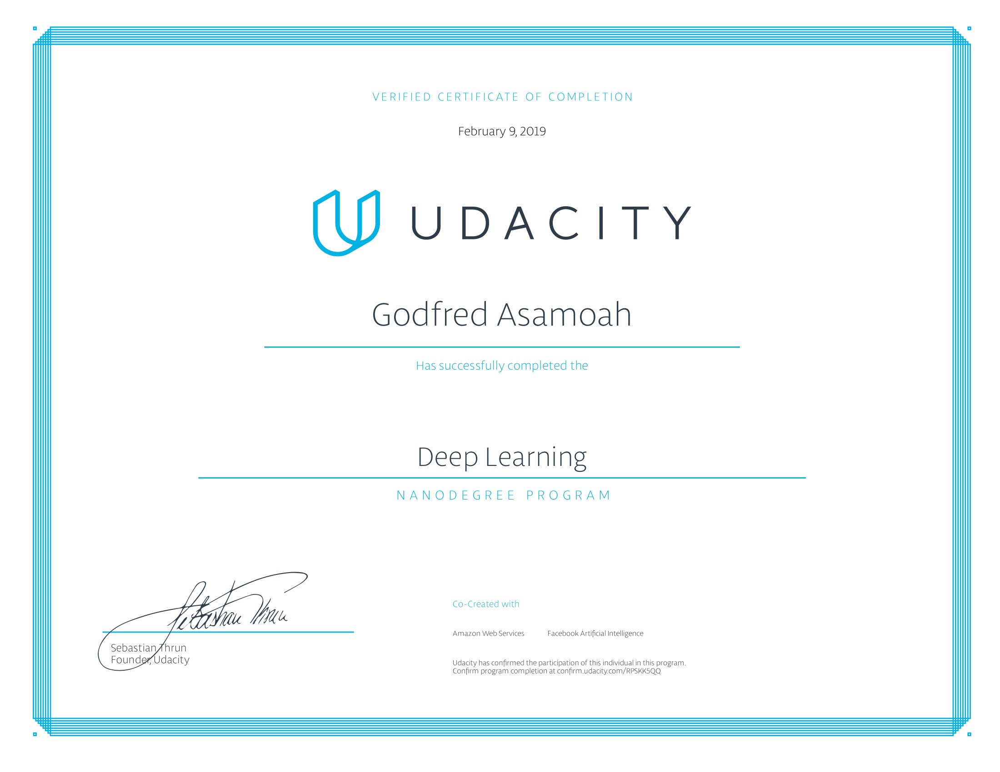

# Deep Learning Nanodegree Projects
This repository contains my solution materials and notebooks for Udacity's [Deep Learning Nanodegree Program](https://www.udacity.com/course/deep-learning-nanodegree--nd101) projects.

## Projects

* [1 - Predicting Bike-Sharing Patterns](/1-bikesharing): Build and train a neural network from scratch using NumPy to predict the number of bikeshare users on a given day.

* [2 - Dog-Breed Classifier](/2-dog-classification): Build a Convolutional Neural Network with PyTorch to classify any image (even an image of a face) as a specific dog breed. 

* [3 - Generate TV Scripts](/3-tv-script-generation): Define and train a Recurrent Neural Network to generate TV scripts. 

* [4 - Face Generation](/4-face-generation): Use a DCGAN(Deep Convolutional Generative Adversarial Network) on the CelebA dataset to generate images of new and realistic human faces. 

* [5 - Deploying a Sentiment Analysis Model using Sagemaker](/5-sagemaker-deployment): Deploy an RNN to perform sentiment analysis on movie reviews complete with publicly accessible API and a simple web page which interacts with the deployed endpoint.

## Graduation Certificate🎉🎉

[Certificate Link](https://confirm.udacity.com/RPSKK5QQ)
